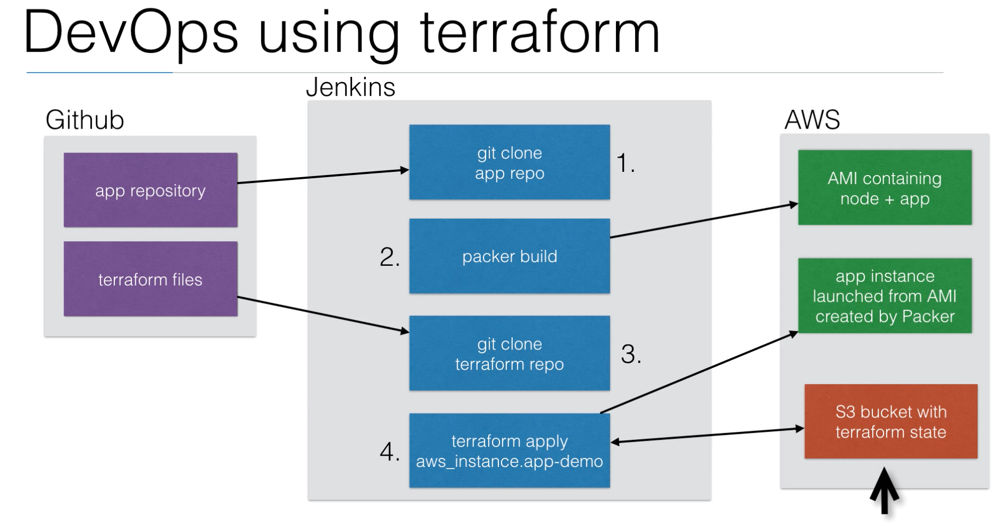

# Terraform

Infrastructure as Code  
Automation of your infrastructure  
Keep your infrastructure in a certain state (compliant)  
-E.g., 2 web instances w/ 2 volumes, and 1 load balancer  
Make your infrastructure auditable  
-Keep your infrastructure change history in version control (b/c it's infrastructure as code)  
Ansible, Chef, Puppet, SaltStack have a focus on automating installation and configuration of software  
-Keeping the machines in compliance, in a certain state  
Terraform can automate provisioning of the infrastructure itself  
-E.g., using AWS, GCP, Azure, etc. APIs  
-Works well with automation software like Ansible to install software after the infrastructure is provisioned  

## Basics

HCL (HashiCorp Configuration Language) - terraform syntax  
Always run `terraform init` first - initializes the provider plugins  
Run `terraform plan` to see what changes will be made  
Then run `terraform apply`  to execute plan  
-^ same as running `terraform plan -out out.terraform ; terraform apply out.terraform ; rm out.terraform`  (do this if you want to be extra careful)  
Run `terraform destroy` to tear down the infrastructure

## Variable types
Simple - `String` / `Number` / `Bool`  
Complex - `List(type)` / `Set(type)` / `Map(type)` / `Object({<ATTR NAME> = <TYPE>, ... })` / `Tuple([<TYPE>, ... ])`  
Set is like a list, but it doesn't keep the order you put it in, and can only contain unique values  
-A list that has [5, 1, 1, 2] becomes [1, 2, 5] in a set  
Object is like a map, but each element can have a different type  
Tuple is like a list, but each element can have a different type  

## Software provisioning
You can upload files using your `.tf` script into instances and also run shell scripts, but in order for you to have access to the created instances you need to first configure your security groups (under VPC) and change the inbound rules to your own IP (all TCP and **your IP**/32)  

## Output
Keeps attributes of all resources created, and they can be queried and outputted  
-E.g., `aws_instance` resource has attribute `public_ip`  
Attributes can be used in shell scripts, useful in starting automation scripts after infrastructure provisioning, populating the IP addresses in an Ansible host file, or run a script (with attributes as arguments) that can map resource names to IP addresses  
## State
Keeps remote state of infrastructure  
Upon running `terraform apply` a new `terraform.tfstate` and `terraform.tfstate.backup` is written - How terraform keeps track of the remote state  
If the remote state changes and you run `terraform apply` again, terraform will make changes to meet the correct remote state again  
E.g., you terminate the instance you provisioned with terraform manually in the console, and then you run `terraform apply`, terraform will provision the instance again  
Version controlling `terraform.tfstate` gives you the history of it  
Using a remote store (`backend.tf` with s3) for the terraform state will ensure that you always have the latest version of the state  
-Advantage of ^: avoids having to version control `terraform.tfstate`  

## Data sources
Provide dynamic information from the cloud provider that can be used as inputs in terraform  
-E.g., list of AWS AMIs, AZs (Availability Zones), IP ranges (CIDR blocks), etc.  

## Modules
Keep your terraform code better organized and reinforce DRY (Don't repeat yourself)  
-Reuse parts of your code for other projects or if you're managing multiple regions, e.g., to set up a VPC in AWS  
Use 3rd party modules like ones from GitHub  
In a module folder you'll just have regular terraform files, e.g., `vars.tf`, `output.tf`, `cluster.tf`, etc.  

### Naming convention
Resources - underscore - e.g., `aws_security_groups`
Resource *names* - dash - e.g., `allow-ssh`

## Packer
*Alternative to this is using Docker*  
CLI tool that can build AWS AMIs based on templates  
Instead of installing software *after* booting up an instance, you can create an AMI using Packer with all the necessary software on it *first*  
Run packer with the `.json` file that holds the configuration to create your AMI, e.g., `packer build -machine-readable packer.json`
Can speed up boot times of instances because you don't have to first install the default image  
Common approach when you run a horizontally scaled app layer or a cluster of something  

### Useful links:
[Repo for Udemy course - "Learn DevOps: Infrastructure Automation w/ Terraform"](https://github.com/wardviaene/terraform-course)  
[Good intro](https://blog.gruntwork.io/a-comprehensive-guide-to-terraform-b3d32832baca)  
[GitLab integration intro](https://timberry.dev/posts/terraform-pipelines-in-gitlab/)  
